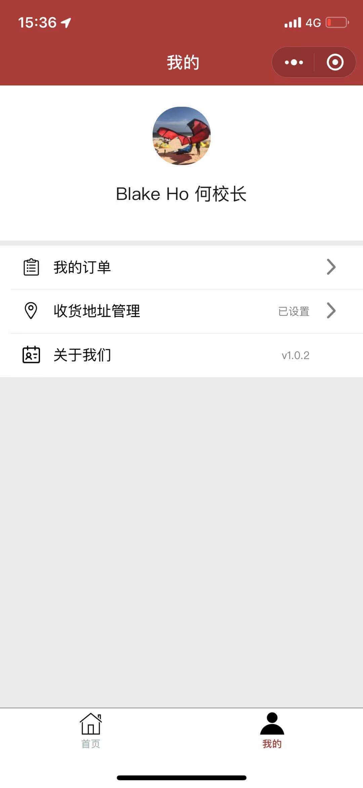
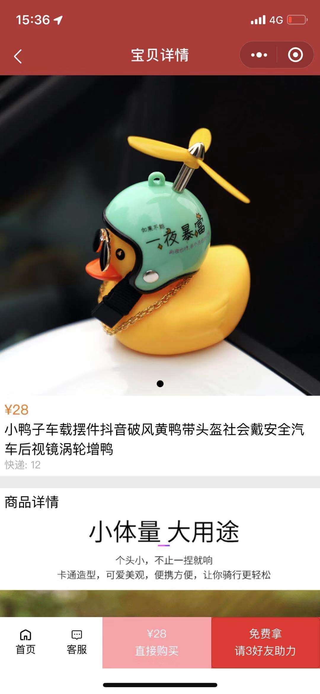

# nwei_shopv2 [](LICENSE) [](https://travis-ci.org/facebook/WebDriverAgent) [](https://github.com/Carthage/Carthage)

nwei_shopv2 is for free.


## Archiving

under coding..

 * [Project on GitHub](https://github.com/yulinho/nwei_shopv2)


## Overview

免费开源的小程序商城，适用于便利店，水果店等常见零售。
稳定可靠，已用于公司多个上线项目。


## Features
 * power by Mpvue

<!-- [](https://youtu.be/EatiYGFxBxY) -->


运行预览：
  - 
  - 
  - 
  - 
  - 
  - 
  - 
  - 

## Getting Started
To get the project set up just run by command:
```
yarn dev
```
It will:
* pack all your codes to 小程序开发工具

After it is finished you can simply open `小程序开发工具` and  `自动运行`


## Known Issues
not yet

## For Contributors
If you want to help us out, you are more than welcome to. However please make sure you have followed the guidelines in [CONTRIBUTING](CONTRIBUTING.md).

## License

[`nwei_shopv2` is BSD-licensed](LICENSE). We also provide an additional [patent grant](PATENTS).

Have fun! ok! 


